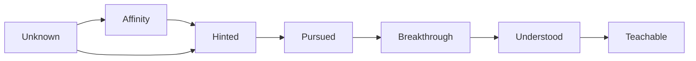
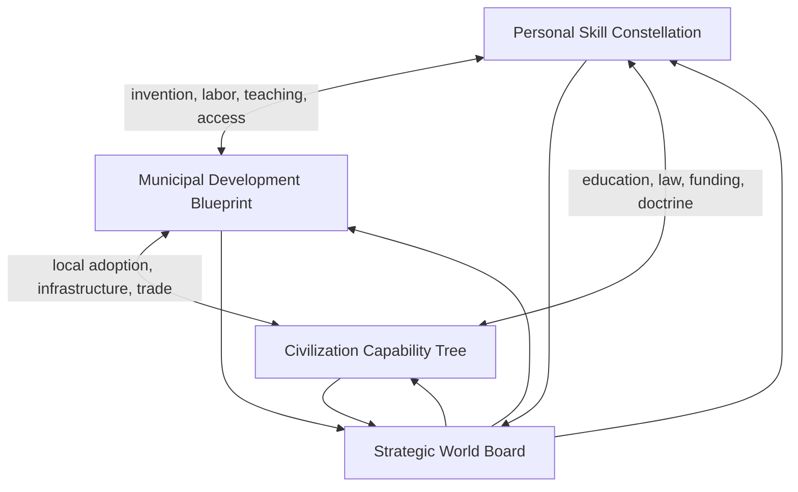

# Xyrtania Living World and Progression Design

**Status:** Approved design checkpoint

**Date:** July 25, 2026

**Purpose:** Preserve the design decisions established during the current
brainstorming phase without turning deferred questions into premature
requirements.

## 1. Scope

This specification defines the relationship among:

- Personal learning and skill discovery.
- Municipal development.
- Civilization-scale capability.
- Knowledge transmission.
- Player and NPC agency.
- The strategic world simulation beneath the 3D world.
- Time progression in single-player and multiplayer.
- The evolving multiplayer introduction.

It does not define complete node lists, balance values, database schemas,
interfaces, implementation order, or production milestones.

## 2. Design Goals

1. Eliminate conventional character levels and disguised numerical grind.
2. Make knowledge a discoverable and transmissible part of the world.
3. Allow both players and NPCs to invent, learn, govern, and change history.
4. Connect personal adventure to city building and civilization strategy
   without forcing leadership on every player.
5. Simulate a large persistent world economically when nobody is present.
6. Make important discoveries change everyday life, trade, interfaces, and
   future character arrivals.

## 3. Personal Skill Constellation

The personal progression interface is a constellation with eight broad regions:
Body, Combat, Wilderness, Craft, Healing, Mysticism, Discovery, and Society.
Specific stars and cross-links may remain hidden until the character encounters
meaningful evidence.

Stars represent affinities, knowledge seeds, techniques, or insight links.
Affinities arise from character history and choices, particularly during the
introductory voyage. They affect sensitivity and discovery opportunity but do
not lock other paths.

Knowledge commonly follows this lifecycle:

The affinity stage is optional for most knowledge. It improves the chance of
noticing or independently discovering a path.

Practice produces meaningful outcomes rather than fractional statistics. It may
improve the human player's execution, maintain physical conditioning, reveal a
clue, or produce a technique breakthrough. Blind repetition alone is
insufficient.

## 4. Technique Discovery

A technique can be learned through:

- A trainer or mentor.
- A book or other recorded knowledge.
- Observation and reconstruction.
- Cultural participation.
- Intentional experimentation.
- Rare independent discovery in an appropriate environment.

Independent discovery should begin subtly. The player may see an unfamiliar
motion, hear an altered sound, produce a partial effect, or notice an NPC's
reaction. The desired response is: “Wait—that was different. What was that?”

Wind Fist demonstrates a cross-region technique. It can require Combat timing,
Body control, and Mysticism or wind sensitivity. A player might learn it
directly or begin discovering it while practicing deliberately in a windy
location.

## 5. Knowledge Diffusion

Ideas exist at several degrees of social maturity:

Witnesses can spread partial knowledge automatically through conversation,
travel, markets, military reports, apprenticeship, scholarship, espionage, and
rumor. Intentional teaching increases speed and fidelity.

Possessing an object proves that it exists but does not grant industrial
capability. An imported arquebus can inspire study while its materials,
ammunition, manufacture, doctrine, training, and supply remain unknown.

## 6. Three Progression Scales

### Personal

Describes what one player or NPC knows and can perform.

### Municipal

Describes what a settlement can build, maintain, reproduce, and provide through
its people, workshops, infrastructure, law, and resources. Authorized civic
leaders interact with it through an in-world planning surface.

### Civilization

Describes what a nation can coordinate and reproduce at scale through research,
education, doctrine, administration, supply, diplomacy, and standardized
institutions. Authorized national leaders interact with it through an in-world
strategic map.

No tier automatically owns a discovery. Knowledge can flow upward, downward,
sideways, or fail to spread.

## 7. Players and NPCs

Players and NPCs use the same world logic. Both may learn, invent, teach, trade,
govern, build, wage war, establish settlements, and compete for authority.

Leadership grants tools and responsibility, not omniscience. Orders depend on
communication, labor, resources, time, and compliance.

## 8. Strategic World Board and 3D Simulation

The strategic board is a low-detail representation of the same continuous
world. It tracks territories, routes, settlements, resources, threats, armies,
trade, and influence.

Remote actors use records, schedules, routes, goals, and strategic tokens.
Detailed bodies, animation, navigation, and local AI instantiate near players.
Relevant strategic consequences then become visible 3D gameplay.

The Spider Queen scenario is the reference case:

1. Traders operate beside Bali.
2. A nearby Spider Queen is disturbed.
3. Her army captures the market area.
4. Trade interruption harms Bali.
5. Prices, news, shortages, travelers, and behavior reveal the impact.
6. Players or NPCs may resolve, avoid, negotiate with, or exploit the threat.
7. Removing the threat permits gradual recovery.

## 9. Time

Single-player advances the larger simulation when the player sleeps. Midnight
may produce a brief notification but does not end an active day by force.

Multiplayer is continuous and never pauses globally. Scheduled or event-driven
work processes the simulation incrementally. NPC schedules continue whether or
not their 3D representations are loaded.

Exact tick rates, batching, catch-up rules, and time scales remain implementation
and playtesting decisions.

## 10. Evolving Arrival and Lost-World Context

Xyrtania is a hidden real-Earth location near Baja California with a
supernatural maritime boundary. Its sky reflects the real stars appropriate to
that location and time.

Before safe maritime infrastructure, new arrivals crash. After lighthouses,
docks, navigation, and associated capabilities exist, future arrivals complete
their formative voyage but reach the dock safely.

The changing introduction records world history. It must not erase the player's
voyage choices or the affinities and relationships they establish.

## 11. Death-Site Objects

Possessions remain at a character's death location long enough to support
retrieval, risk, scavenging, and emergent stories. Unrecovered objects eventually
decay or are removed so persistent world storage remains bounded. Exact
ownership rules and timers require playtesting.

## 12. Deferred Decisions

- Complete constellation stars and prerequisites.
- Complete municipal and civilization trees.
- Numerical progression and balance.
- Tick rates and simulation storage.
- User interfaces for all three scales.
- Aging, inheritance, and permanent death.
- External trading partners.
- Political processes and authority transfer.
- The origin of the maritime barrier.
- Implementation sequence.

These items remain deliberately open. They are future design work, not missing
requirements for the current documentation checkpoint.

## 13. Consistency Rules

Future additions should preserve the following:

1. No universal character level.
2. No reward structure based primarily on repetitive grind.
3. Knowledge and technology are different from mere awareness.
4. Players and NPCs can be consequential world actors.
5. Personal, municipal, and civilization progression remain distinct but
   connected.
6. The strategic board and 3D world describe one world at different detail.
7. Multiplayer remains continuous.
8. Civilization management remains optional for personal-scale adventurers.
